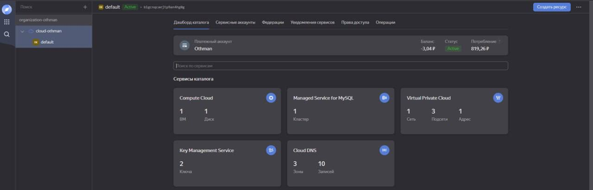

### Описание информационной системы
Приложение для создания маршрута по магазину после выбора интересующих продуктов. Можно изменить параметры построения для нужного результата. Имеются 3 страницы:
+ «Домой» — это основная страница, на которой происходят все действия. Здесь можно выбрать продукт, узнать их нахождение в магазине, выбрать параметры построения, а также начать построение и лицезреть результат создания маршрута.
+ «Помощь» - страница с инструкции по использованию системы.
+ «Админ» - панель администратора, где можно обновлять свойства продуктов/категорий, добавлять и удалять продукты.

Также имеется функция изменения языка (русский/английский).

Приложение построенно на базе фреймвороков JS -> React и Python -> Flask, 
***
### Требования к системе
+ Отказоустойчивость при росте числа посетителей.
+ Исправная работа всех описанных функций приложения.
***
### CRUD-операции
+ _Create_ – создание продуктов в панели администратора.
+ _Read_ – загрузка категорий и продуктов из базы данных.
```python
@app.route('/categories', methods=['GET'])
def categories_get():
    categories = Category.query.all()
    categoriesarray = []
    for category in categories:
        categoriesarray.append(category.to_json)
    return jsonify(categories=categoriesarray)
```
```python
@app.route('/categories', methods=['GET'])
def categories_get():
    categories = Category.query.all()
    categoriesarray = []
    for category in categories:
        categoriesarray.append(category.to_json)
    return jsonify(categories=categoriesarray)
```
+ _Update_ – обновление свойств категорий/продуктов в панели администратора.
```python
@app.route('/category', methods=['POST'])
def update_category():
    id = request.json.get("id", None)
    name = request.json.get("name", None)
    start_x = request.json.get("start_x", None)
    start_y = request.json.get("start_y", None)
    end_x = request.json.get("end_x", None)
    end_y = request.json.get("end_y", None)
    with app.app_context():
        category = db.session.query(Category).filter(Category.id == id).first()
        if id != None:
            category.name = name
            category.start_x = start_x
            category.start_y= start_y
            category.end_x = end_x
            category.end_y = end_y
            db.session.commit()
            return jsonify({'msg': 'Вы обновили категорию'}), 200
        return jsonify({'msg': 'Не правильные данные'}), 401
```
+ _Delete_ – удаление продуктов в панели администратора.
***
### Структура хранения данных
В качестве хранения данных используется кластер MySQL.

Таблица продуктов:


Таблица категорий:

***
### Использование Object Storage
Не использовался
***
### Terraform-спецификации
Не использовался
***
### Serverless-решение
Не использовался
***
### Приложение
1.Главная страница yandex cloud:


2.Виртуальная машина с проектом


3.Диск виртуальной машины


4.База данных MySQL


5.Виртуальная сеть default и её подсети, используемые в проекте


6.Группа безопасности на исходящий трафик


7.Группа безопасности на входящий трафик

